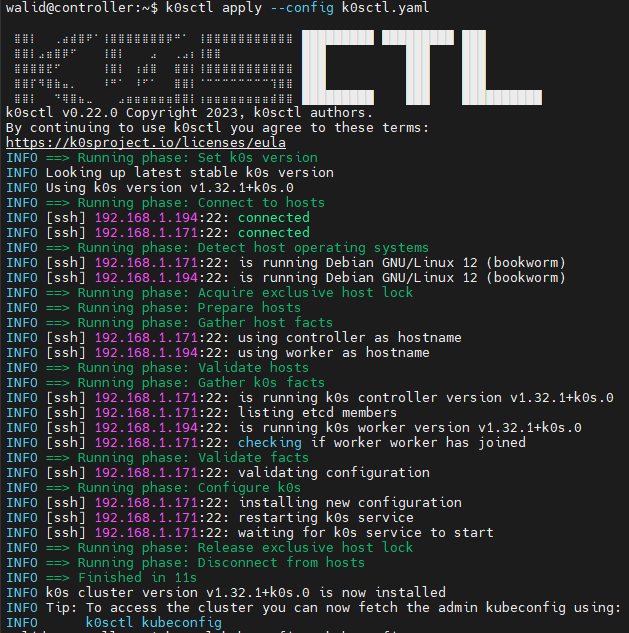

# K0S: A Lightweight and Modern Kubernetes Distribution in Detail

K0S is a minimalist and autonomous Kubernetes distribution designed to be easy to deploy and manage. It is maintained by Mirantis and stands out from other Kubernetes distributions with its simplified architecture, dependency-free approach, and full compatibility with the Kubernetes ecosystem.

In this in-depth analysis, we will explore its internal components, technical advantages, comparison with other Kubernetes distributions, and advanced use cases.

## 1. K0S Architecture

K0S differs from classic distributions like K3s or MicroK8s by adopting an all-in-one model based on a ``single binary`` and ``removing etcd``, making it lighter and easier to manage.

### 1.1 A Single and Self-Sufficient Binary

All Kubernetes components (API Server, Controller Manager, Scheduler, Kubelet, Proxy, etc.) are included in a single executable.

**✅ Advantages:**
- Simplifies installation and maintenance: a single command launches a complete cluster.
- Fewer version conflicts.
- Better portability.

### 1.2 Removal of etcd: A Revolution for Lightweight Operation

K0S replaces etcd with SQLite (by default) or Kine for more complex environments.

**✅ Advantages:**
- Lower memory consumption (~40% gain compared to etcd).
- Lower latency for small to medium-sized clusters.
- Avoids the maintenance issues of an etcd cluster.

### 1.3 K0S Deployment Modes

K0S supports several deployment modes:
- **Single-Node Mode:** Ideal for development or small workloads.
- **Multi-Node with HA Mode:** Multiple master nodes can be synchronized without etcd.
- **Edge & IoT Mode:** Can run on lightweight ARM64 / x86_64 devices with minimal resources.

## 2. Installing K0S

### 2.1 Prerequisites

Before installing K0S, ensure you have:
- A Linux machine (Ubuntu, Debian, CentOS, etc.).
- An Internet connection to download the binary.
- Sudo permissions to execute the installation (unless in rootless mode).
- `curl` or `wget` installed to retrieve the binary.

### 2.2 Download and Installation

On a Linux machine, run the following command to download and install K0S:

```sh
curl -sSLf https://get.k0s.sh | sudo sh
```

**🔹Explanation:**

- `curl -sSLf`: Downloads the installation script.
- `https://get.k0s.sh`: The official URL to retrieve the binary.
- `sudo sh`: Executes the script as an administrator.
- The script automatically downloads the K0S binary and installs it in `/usr/local/bin/k0s`.

If you want to install a specific version, use:

```sh
curl -sSLf https://get.k0s.sh | sudo K0S_VERSION=v1.21.2+k0s.0 sh
```

## 3. Starting a Kubernetes Cluster with K0S

### 3.1 Initializing the Master Node (First Method)

On the machine that will act as the controller (master), run:

```sh
sudo k0s install controller --single
```
Then start the service:

```sh
sudo k0s start
```

**🔹 Explanation:**

- `k0s install controller --single`: Installs a standalone controller (without a worker).
- `k0s start`: Starts the Kubernetes components (API Server, Scheduler, Controller Manager).

**💡 What happens internally?**

- K0S starts a complete Kubernetes server, but instead of using etcd for data storage, it uses SQLite.
- The Kubernetes API is accessible on `localhost:6443`, and control components begin orchestrating future nodes.

### 3.2 Master Node Initialization (Second Method)

On the machine that will act as the controller (master), create a configuration file:

```sh
k0s config create > k0s.yaml
```

**📝 Note**: The command `default-config` is deprecated; you can use `k0s config create` instead.

```sh
k0s config create > k0s.yaml
```

✅ You can edit the file and update settings (refer to the configuration documentation).

```sh
sudo k0s install controller -c k0s.yaml
sudo k0s start
```

The `k0s` process acts as a supervisor for all control plane components. Within moments, the control plane will be up and running.

### Creating a Token for Workers

To add workers to the cluster, you need a token. This token contains information that establishes mutual trust between the worker and controller(s) and allows the node to join the cluster as a worker.

To generate a token, run the following command on one of the existing controller nodes:

```sh
k0s token create --role=worker
```

The output will be a long token string, which you can use to add a worker to the cluster.

For enhanced security, you can set an expiration time for the token by running the following command:

```sh
k0s token create --role=worker --expiry=100h > token-file
```

### 3.4. Adding Workers to the Cluster

To add a worker, run K0S in worker mode using the join token you created:

```sh
sudo k0s install worker --token-file /path/to/token-file

sudo k0s start
```

**🔹 Explanation:**

- `k0s token create --role=worker > token-file`: Generates a secure token to join the cluster.
- `k0s install worker --token-file /path/to/token-file`: Configures the worker to automatically register with the controller.

**What happens after the worker connects?**

- It automatically downloads the cluster configuration.
- It runs a Kubelet agent to manage pods on the machine.
- It communicates with the Kubernetes API Server to receive instructions.

### 3.5. Verifying the Cluster

After adding the workers, check the cluster status with:

```sh
sudo k0s kubectl get nodes
```

You should see your controller and workers in Ready status.

## 4. Deploy an Application on K0S

Once your K0S cluster is up and running, you can deploy a Kubernetes application.

### 4.1. Deploying an Nginx Pod

Run the following command to create an Nginx pod:

```sh
sudo k0s kubectl run nginx --image=nginx --port=80
```

Verify that the pod has started:

```sh
sudo k0s kubectl get pods
```

**🔹 Explanation:**

- `kubectl run nginx --image=nginx --port=80`: Creates a pod with the official Nginx image.
- `kubectl get pods`: Lists the running pods.

### 4.2. Exposing the Pod via a Service

To make the service accessible, create a NodePort service:

```sh
sudo k0s kubectl expose pod nginx --type=NodePort --port=80
```

Find the exposed port:

```sh
sudo k0s kubectl get svc
```

You will see a NodePort assigned (e.g., 30180). Test by accessing the worker's IP:

```sh
curl http://<worker-ip>:30180
```

**🔹 Explanation:**

- A service exposes a pod to make it accessible via the network.
- NodePort allows access to the pod from outside the cluster.

##5. k0sctl: Simplified Cluster Management

k0sctl is a command-line tool for bootstrapping and managing k0s clusters. k0sctl connects to the provided hosts using SSH and gathers information on the hosts, with which it forms a cluster by configuring the hosts, deploying k0s, and then connecting the k0s nodes together.


With k0sctl, you can create multi-node clusters in a manner that is automatic and easily repeatable. This method is recommended for production cluster installation.

**Note**: The k0sctl install method is necessary for automatic upgrade.

### 5.1. Installing k0sctl

```sh
sudo wget https://github.com/k0sproject/k0sctl/releases/download/v0.22.0/k0sctl-linux-amd64 -P /usr/local/bin/
sudo mv /usr/local/bin/k0sctl-linux-amd64 /usr/local/bin/k0sctl
sudo chmod +x /usr/local/bin/k0sctl
```

### 5.2. Configuration and Deployment

Run the following command to create a k0sctl configuration file:

```sh
k0sctl init > k0sctl.yaml
```

This action creates a k0sctl.yaml file in the current directory:

```sh
walid@controller:~$ cat k0sctl.yaml
apiVersion: k0sctl.k0sproject.io/v1beta1
kind: Cluster
metadata:
  name: k0s-cluster
spec:
  hosts:
  - ssh:
      address: 192.168.1.171
      user: walid
      port: 22
      keyPath: ~/.ssh/id_rsa
    role: controller
    privateInterface: enp0s3
  - ssh:
      address: 192.168.1.194
      user: walid
      port: 22
      keyPath: ~/.ssh/id_rsa
    role: worker
    privateInterface: enp0s3
```

Provide each host with a valid IP address that is reachable by k0ctl, along with the connection details for an SSH connection and the network interface.

### 5.3. Deploy the Cluster

Before we start deploying our cluster, we must check the SSH connection between the controller and the worker. We need to copy the SSH key to each machine. To do that, run the following commands:

```sh
ssh-copy-id -i /home/walid/.ssh/id_rsa.pub walid@192.168.1.194
ssh-copy-id -i /home/walid/.ssh/id_rsa.pub walid@192.168.1.171
```

Run k0sctl apply to perform the cluster deployment:

```sh
k0sctl apply --config k0sctl.yaml
```



### 5.4. Access the Cluster

To access your k0s cluster, use k0sctl to generate a kubeconfig for this purpose:

```sh
k0sctl kubeconfig > kubeconfig
```

Then, use k0s kubectl to check the status of the nodes:

```sh
sudo k0s kubectl get nodes
NAME         STATUS     ROLES           AGE     VERSION
controller   NotReady   control-plane   12m     v1.32.1+k0s
worker       Ready      <none>          8m36s   v1.32.1+k0s
```

